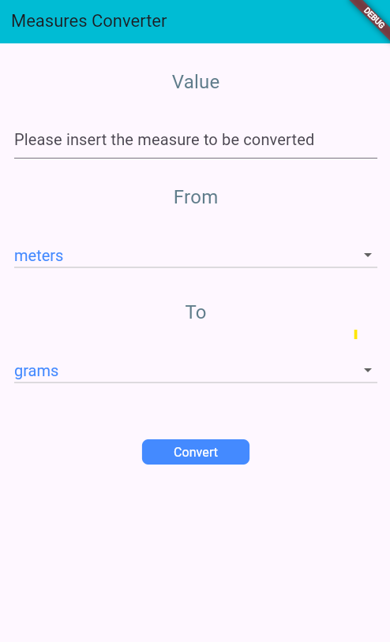

# **Measures Converter App**

## **Overview**
A simple Flutter app for measures conversion with user-friendly input fields, dropdown menus, and a responsive design.

---

## **Features**
- Text field for user input.
- Dropdowns for selecting "From" and "To" conversion units.
- Conversion button to trigger the logic.
- Dynamic result display.

---

## **Installation**
1. Clone the repository:
   ```bash
   git clone https://github.com/anasassad/Unit-Converter.git
2. Navigate to the project directory:
   ```bash
   cd unit_converter
4. Install dependencies:
   ```bash
   flutter pub get
6. Run the app:
   ```bash
   flutter run
---

## **Screenshots**
### Final Project Overview

